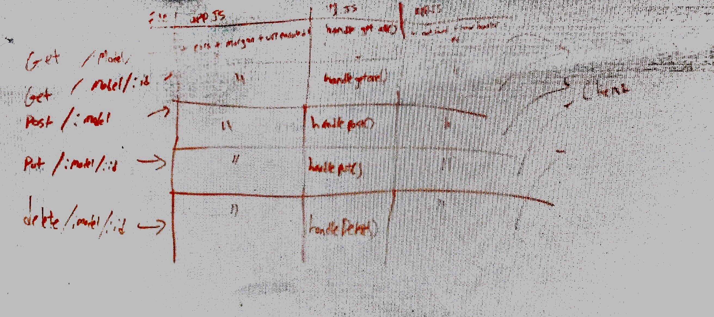

# LAB

## Project Name: LAB 9 API Server

### Author: Adriana Graybill

### Links and Resources
* [repo](https://github.com/adriana-401-advanced-javascript/lab-09/pull/3)
* 
* [Travis link](https://travis-ci.com/adriana-401-advanced-javascript/lab-09)
* [back-end](https://lab-09-401.herokuapp.com/)

#### Documentation
* [swagger](https://localhost:/3333/api-docs) only run after npm start, does not work in heroku

### Modules
#### categories-schema.js
#### product-schema.js
#### data-model.js
#### products.js --extends dataModel
#### categories.js --extends dataModel

### Setup
#### `.env` requirements
* `PORT` - running on 3000
* `MONGODB_URI=localhost:27017/lab-09`

#### Running the app
* `npm start`
* Endpoint:  `api/v1/products` 
  * Returns a JSON object with name, description, display, inside
* Endpoint: `api/v1/categories`
  * eturns a JSON object with name, description, display, and category inside

Commands for the command line: 
Post: `echo '{"name" : "a","cateogry" : "b"}' | http post :3000/api/v1/{route}`

Put: `echo '{"category" : "a", "color" : "my put}' | http put :3000/api/v1/{route}/{id}`

Get All: `http :3000/api/v1/{route}`

Get: `http :3000/api/v1/{route}/{id}`

Delete: `http :3000/api/v1/{route}/{id}`

Running Mongo:
* start mongodb path path/to/database
* start mongod in another window
* show dbs
* run: db.products.find().pretty(); to print all items in db

#### Tests
* How do you run tests? 
* * npm run tests
* What assertions were made?
* * Asserts that sanitize work correctly
* * Asserts that post, get, put and delete work correctly for /categories
* What assertions need to be / should be made?
* * Assertions need to be made for the /products route to check categories 

#### UML

